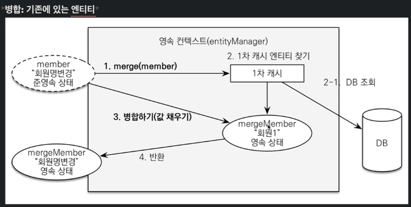

# 김영한님 인프런 실전! 스프링 부트와 JPA 활용1 - 웹 애플리케이션 개발 코드 따라적어보기
---

### 요구사항 분석


- 기본적인 쇼핑몰

**테이블 설계**


**회원, 주문 상품의 관계**
- 회원: 여러 상품을 주문, 한번 주문시 여러 상품이 선택되므로 주문과 상품은 다대다.
  - 상품 - 주문의 관계를 주문상품 이라는 엔티티를 추가해 1:N, N:1 관계로 풀어냄.

**상품 분류**
- 상품은 도서, 음반, 영화로 구분되어 상품이라는 공통 속성을 사용하므로 이를 "상품" 이라는 클래스를 만들고 이를 상속하는 구조로 표현.

**회원 엔티티 분석**


- 회원 테이블 : 임베디드 타입으로 Address, Orders (List)를 가짐.
- 주문 테이블 : 한번 주문시 여러 상품을 주문할 수 있으므로 OrderItem 은 1:N 관계.
  - 주문은 상품을 주문한 회원과 배송정보, 주문날짜, 주문 상태(Status)를 가지고있다. 주문상태는 enum 을 사용. (ORDER, CANCEL)
- 주문상품(OrderItem) : 주문한 상품 정보와 주문금액, 수량을 가지고있다. (통상적으로 OrderLine, LineItem 으로 많이 표현)
- 상품 : 이름, 가격, 재고수량을 갖고있다. 주문시 재고 수량이 줄어듬.
- 배공 : 주문시 하나의 배송 정보를 생성. 주문 - 배송 : 1:1 관계.
- 카테고리 : 상품과 N:N 관계. parent, child 로 부모 자식 카테고리를 연결.
- 주소 : Embedded Type. 회원과 배송에서 사용.

**회원 테이블 분석**


---

## 알게된 점

**persistence.xml**
- Springboot 는 복잡한 설정을 자동화시켜 이전처럼 persistence.xml 같은걸 resources/META-INF 이런데다가 안만들어도 된다.

---

## 주의점


### 엔티티 설계시
**가급적 Setter 사용을 지양한다.**
- Setter 가 열려있으면 변경포인트가 많아 유지보수 극혐. 개발중엔 @Setter 를 써도, 프로덕션레벨쯤 가면 Refactoring 으로 Setter 제거

**모든 연관관계는 Lazy로 설정**
- EAGER(즉시 로딩)은 예측이 어렵고 어떤 SQL 이 실행될지 추적 어려움. 특히 JPQL 을 사용할때 N+1문제가 자주 발생. (쓸데없는 쿼리 발생 = 성능 저하)
- 즉, 실무에선 모든 연관관계는 LAZY(지연로딩)로. 연관된 엔티티를 함께 DB 에서 조회할 떈 fetch join 또는 엔티티 그래프 기능 사용.
  - **@OneToOne**, **@ManyToOne**은 기본값이 EAGER 이므로 신경써서 LAZY 로 바꾸기.

**컬렉션은 필드에서 초기화**
컬렉션은 필드에서 바로 init 하는게 안전함. (Member 클래스 내 orders 와 같은 애들)
- null safety.
- Hibernate 는 엔티티를 영속화할 때 컬렉션을 감싸 하이버네이트가 제공하는 내장 컬렉션으로 제공함. 만약 임의로 **getOrders()** 처럼 임의 메소드에서 컬렉션을 잘못 생성하면 하이버네이트 내부 매커니즘에 문제 발생 가능.따라서 필드레벨에서 생성하는게 가장 안전하고, 코드가 간결하다.

```java
Member member = new Member();
System.out.println(member.getOrders().getClass()):
em.persist(team);
System.out.println(member.getOrders().getClass()):

// 출력 결과 
 class java.util.ArrayList 
 class org.hibernate.collection.internal.PersistentBag
```
---

## 애플리케이션 아키텍처


**계층형 구조 사용**
- controller, web : 웹 계층
- service : 비즈니스 로직, 트랜잭션 처리
- repository : JPA 를 직접 사용하는 계층. EntityManager 사용
- domain : 엔티티가 모여있는 계층, 모든 계층에서 사용

---

## 도메인 모델 패턴

>현재 **OrderService** 에서 주문, 주문취소하는 메소드를 들어가보면 알겠지만,
>비즈니스 로직 대부분이 **엔티티 내에** 정의되어있다. 서비스 계층에서는
>단순히 엔티티에 필요한 요청을 위임하는 역할만 수행한다. 이렇게 
>엔티티가 비즈니스로직을 가지고 객체지향의 특성을 적극 활용하는 것을 
>**도메인 모델 패턴**이라고 한다.
>반대로 엔티티에는 비즈니스 로직이 거의 없고 서비스 계층에서 
>대부분의 비즈니스 로직을 처리하는걸 **트랜잭션 스크립트 패턴**이라고 한다.

---

## 타임리프에서
#### 참고
- 타임리프에서 ?를 사용하면 null 을 무시한다. Dart 에서의 Nullable (String?, Widget? 등과 같이)
- 폼 객체 vs 엔티티 직접 사용 
- 요구사항이 정말 단순할 때
  - 폼 객체(**MemberForm**) 없이 엔티티(**Member**)를 직접 등록과 수정 화면
  에서 사용해도 된다. 하지만 화면 요구사항이 복잡해지기 시작하면, 엔티티에 화면을 처리하기 위한 기능이 점점 증가한다. 결과적으로 엔티티는 점점 화면에 종속적으로 변하고, 이렇게 화면 기능 때문에 지저분해진 엔티티는 결국 유지보수하기 어려워진다.
  실무에서 **엔티티는 핵심 비즈니스 로직만 가지고 있고, 화면을 위한 로직은 없어야 한다.** 화면이나 API에 맞 는 폼 객체나 DTO를 사용하자. 그래서 화면이나 API 요구사항을 이것들로 처리하고, 엔티티는 최대한 순수 하게 유지하자.

---

## 변경 감지와 병합(Merge)

### 준영속 엔티티?
- 영속성 컨텍스트가 더는 관리하지 않는 엔티티를 말한다.
  - 예시로, 이 소스에서의 ItemService.saveItem(book) 등과 같이 매개변수로 들어온 엔티티객체.
  - 이 객체는 이미 DB에 한번 저장되었다가 온 놈이라 @GeneratedValue 에 의해 식별자 값이 존재한다.
  - 그런데, 얘는 EntityManager.persist()로 DB에 다녀왔다 뿐이지 EntityManager 와 연결은 끊어져있다. 이러한 준영속 엔티티는 아래의 두가지 방법으로 수정결과를 반영할 수 있다.
    - 방법 1. **변경 감지 기능** 사용
    - 방법 2. **병합(merge)** 사용

#### 변경 감지 기능 사용
- 내가 받은 식별자를 이용해 JPA에서 영속성 컨텍스트에 있는 엔티티를 불러온 후, 그 엔티티의 값을 변경한다.
- 이 경우 @Transactional 이 붙어있기 때문에 이 메소드가 호출된 후 자동으로 EntityManager.flush() 가 호출되어 commit 명령이 떨어지고, 엔티티에 대한 수정사항은 DB 에 반영된다.
```java
@Transactional
void updateItem(Item itemParam){ // 매개변수로 들어온 준영속 상태의 엔티티
    //같은 엔티티를 조회해 JPA 가 관리하도록.
    Item item = em.find(Item.class, itemParam.getId());
    item.setPrice(10000); // 이제 값을 수정하면 JPA 가 UPDATE 쿼리를 보낸다.
}
```

#### 병합(merge) 사용 (사진 : 회원정보 변경의 경우)


상세한 동작방식은 다음과 같다.
1. merge()를실행한다.
2. 파라미터로 넘어온 준영속 엔티티의 식별자 값으로 1차 캐시에서 엔티티를 조회한다.
   2-1. 만약 1차 캐시에 엔티티가 없으면 데이터베이스에서 엔티티를 조회하고, 1차 캐시에 저장한다.
3. 조회한 영속 엔티티( mergeMember )에 member 엔티티의 값을 채워 넣는다. (member 엔티티의 모든 값
   을 mergeMember에 밀어 넣는다. 이때 mergeMember의 “회원1”이라는 이름이 “회원명변경”으로 바
   뀐다.)
4. 영속 상태인 mergeMember를 반환한다.

병합 방법은
- 준영속 상태(영속성 컨텍스트에 들어온 적이 있는 상태)의 엔티티를 영속성 컨텍스트에 있는 기존의 엔티티와 아예 바꿔버린다.
- 이 경우 직관적으로 값변경이 되는걸 볼 수는 있지만, 내가 세팅한 값들 이외에는 모두 null 이 들어있을텐데, 이런 null checking 없이 이 엔티티를 빠꾸없이 **밀어넣어버린다**.
- 기존 엔티티에 있던 값을 모두 하나하나 새 엔티티에 저장해놓고 merge()를 돌리지 않는 이상, 저장되어있던 데이터 날리기 딱 좋다.
- 아래 소스코드에서 else 부분이 이에 해당한다.
```java
public class ItemRepository {
  private final EntityManager em;

  public void save(Item item) {
      // 들어온 item 의 식별자가 존재안한다 = 새로만들어진 엔티티다 = persist
      if(item.getId()!=null) em.persist(item);
      // 들어온 item 의 식별자가 존재하면 이 아이템 객체를 기존의 엔티티와 완전히 교체.
      else em.merge(item); 
  }
  
}
```

#### 정리 (변경 감지 VS 병합)
- 변경 감지 기능을 사용하면 원하는 속성만 변경할 수 있지만, 병합 기능을 사용하면 모든 속성이 새 엔티티 기준으로 바뀌어버린다.
- 만약, 병합시 특성 속성에 값을 안넣어버리면 null 상태 그대로 업데이트 해버릴 위험이 있다.