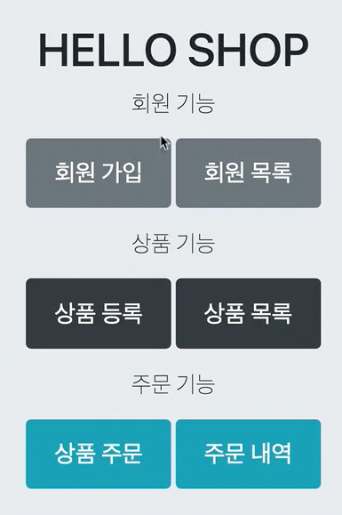
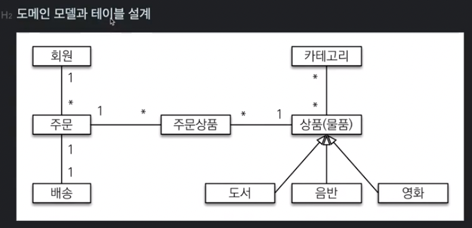
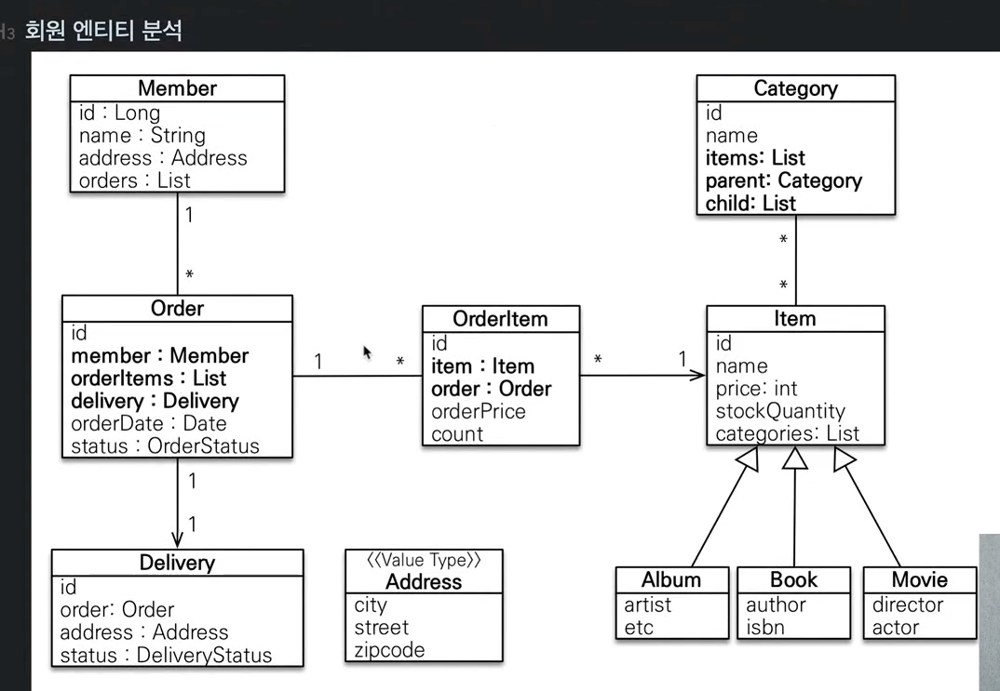
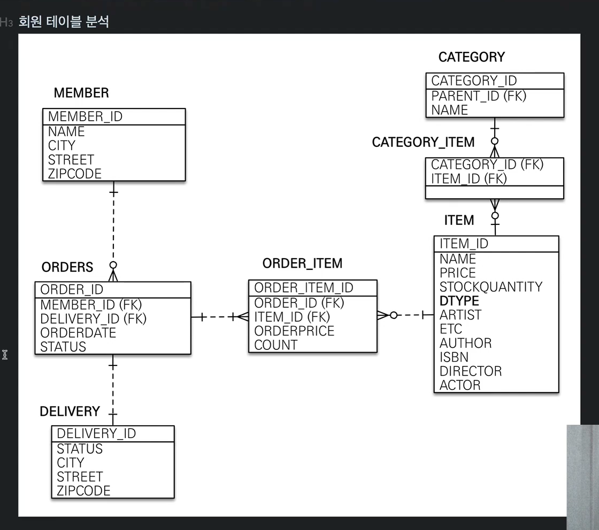
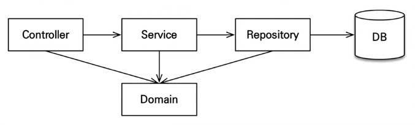

# 김영한님 인프런 실전! 스프링 부트와 JPA 활용1 - 웹 애플리케이션 개발 코드 따라적어보기
---

### 요구사항 분석



- 기본적인 쇼핑몰

**테이블 설계**



**회원, 주문 상품의 관계**
- 회원: 여러 상품을 주문, 한번 주문시 여러 상품이 선택되므로 주문과 상품은 다대다.
  - 상품 - 주문의 관계를 주문상품 이라는 엔티티를 추가해 1:N, N:1 관계로 풀어냄.

**상품 분류**
- 상품은 도서, 음반, 영화로 구분되어 상품이라는 공통 속성을 사용하므로 이를 "상품" 이라는 클래스를 만들고 이를 상속하는 구조로 표현.

**회원 엔티티 분석**



- 회원 테이블 : 임베디드 타입으로 Address, Orders (List)를 가짐.
- 주문 테이블 : 한번 주문시 여러 상품을 주문할 수 있으므로 OrderItem 은 1:N 관계.
  - 주문은 상품을 주문한 회원과 배송정보, 주문날짜, 주문 상태(Status)를 가지고있다. 주문상태는 enum 을 사용. (ORDER, CANCEL)
- 주문상품(OrderItem) : 주문한 상품 정보와 주문금액, 수량을 가지고있다. (통상적으로 OrderLine, LineItem 으로 많이 표현)
- 상품 : 이름, 가격, 재고수량을 갖고있다. 주문시 재고 수량이 줄어듬.
- 배공 : 주문시 하나의 배송 정보를 생성. 주문 - 배송 : 1:1 관계.
- 카테고리 : 상품과 N:N 관계. parent, child 로 부모 자식 카테고리를 연결.
- 주소 : Embedded Type. 회원과 배송에서 사용.

**회원 테이블 분석**



---

## 알게된 점

**persistence.xml**
- Springboot 는 복잡한 설정을 자동화시켜 이전처럼 persistence.xml 같은걸 resources/META-INF 이런데다가 안만들어도 된다.

---

## 주의점


### 엔티티 설계시
**가급적 Setter 사용을 지양한다.**
- Setter 가 열려있으면 변경포인트가 많아 유지보수 극혐. 개발중엔 @Setter 를 써도, 프로덕션레벨쯤 가면 Refactoring 으로 Setter 제거

**모든 연관관계는 Lazy로 설정**
- EAGER(즉시 로딩)은 예측이 어렵고 어떤 SQL 이 실행될지 추적 어려움. 특히 JPQL 을 사용할때 N+1문제가 자주 발생. (쓸데없는 쿼리 발생 = 성능 저하)
- 즉, 실무에선 모든 연관관계는 LAZY(지연로딩)로. 연관된 엔티티를 함께 DB 에서 조회할 떈 fetch join 또는 엔티티 그래프 기능 사용.
  - **@OneToOne**, **@ManyToOne**은 기본값이 EAGER 이므로 신경써서 LAZY 로 바꾸기.

**컬렉션은 필드에서 초기화**
컬렉션은 필드에서 바로 init 하는게 안전함. (Member 클래스 내 orders 와 같은 애들)
- null safety.
- Hibernate 는 엔티티를 영속화할 때 컬렉션을 감싸 하이버네이트가 제공하는 내장 컬렉션으로 제공함. 만약 임의로 **getOrders()** 처럼 임의 메소드에서 컬렉션을 잘못 생성하면 하이버네이트 내부 매커니즘에 문제 발생 가능.따라서 필드레벨에서 생성하는게 가장 안전하고, 코드가 간결하다.

```java
Member member = new Member();
System.out.println(member.getOrders().getClass()):
em.persist(team);
System.out.println(member.getOrders().getClass()):

// 출력 결과 
 class java.util.ArrayList 
 class org.hibernate.collection.internal.PersistentBag
```
---

## 애플리케이션 아키텍처



**계층형 구조 사용**
- controller, web : 웹 계층
- service : 비즈니스 로직, 트랜잭션 처리
- repository : JPA 를 직접 사용하는 계층. EntityManager 사용
- domain : 엔티티가 모여있는 계층, 모든 계층에서 사용

---

## 도메인 모델 패턴

>현재 **OrderService** 에서 주문, 주문취소하는 메소드를 들어가보면 알겠지만,
>비즈니스 로직 대부분이 **엔티티 내에** 정의되어있다. 서비스 계층에서는
>단순히 엔티티에 필요한 요청을 위임하는 역할만 수행한다. 이렇게 
>엔티티가 비즈니스로직을 가지고 객체지향의 특성을 적극 활용하는 것을 
>**도메인 모델 패턴**이라고 한다.
>반대로 엔티티에는 비즈니스 로직이 거의 없고 서비스 계층에서 
>대부분의 비즈니스 로직을 처리하는걸 **트랜잭션 스크립트 패턴**이라고 한다.
