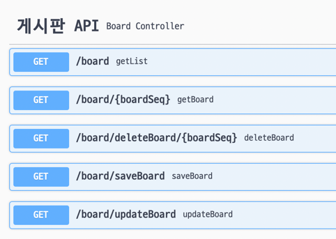

# 인프런 송자바님 자바 스프링부트 활용 웹개발 실무용 강의영상 따라해보기

---

Springboot 2.6.2 Gradle 프로젝트, 자바 11 사용, 패키징 방식: .jar

### 사용된 라이브러리
- MyBatis Framework
- Springboot Web
- Springboot Dev Tools
- MySQL Driver
- Spring Configuration Processor
- Lombok

---
## 알게된 점, 핵심 내용 등은 여기에 적어볼 예정.

**MyBatis**
- Java Persistence Framework 중 하나로, 개발자가 적은 SQL과 여러 클래스를 매핑해주는 프레임워크이다.
- JDBC로 처리하는 상당수의 코드와 파라미터 설정및 결과 매핑을 대신해준다. 마이바티스는 데이터베이스 레코드에 원시타입과 Map 인터페이스 그리고 자바 POJO 를 설정해서 매핑하기 위해 XML과 애노테이션을 사용할 수 있다.

**MyBatis VS JPA**
- 공부중. 아무튼 둘다 JdbcTemplate 이나 아니면 직접 PrepareStatement 등을 작성하는 것 보다는 수월해 보이긴 한다.

**Swagger**
- API 를 만들어서 누군가 쓰도록 할 때, 이 API 의 사용법을 내 소스를 기반으로 "DB에서 한건 조회하려면 요렇게 하고, 값을 넣으려면 이렇게 하면 됨 ㅇㅅㅇ" 하는 등의 API 사용법 페이지를 자동으로 만들어주는 친절한 이웃 스파이더맨 같은 라이브러리이다. 

MyBatis는 자바에서 SQL Mapper를 지원해주는 Framework이다.

즉, SQL 작성을 직접 하여 객체와 매핑시켜준다.

추가: 프로시저(PL/SQL 같은 친구들), POJO(순수 자바코드, 즉 직접 만든 엔티티(class)), 원시타입(기본형)

---

# Annotations

## 메인 애플리케이션 클래스 
***@SpringBootApplication***
- 스프링이 실행되면 이 어노테이션이 붙은 클래스를 찾아 main method 를 실행한다.

## 컨트롤러 단

***@PathVariable***
- URL속 쿼리스트링 값을 가져올 수 있다.

***@RestController***
- 마우스를 가져다 대 보면 기존의 URL 매핑에 따른 응답을 담당하는 @Controller와 @ResponseBody 가 결합된 형태로, 스프링으로 만든 백앤드에서 openWeatherAPI와 같이 값을 가져올 수 있는 REST API를 구현하고자 할 때 사용할 수 있다. 추후에 만들어볼 ReactJS X Springboot 프로젝트에서 요긴하게 쓰일 예정이다.
  - @ResponseBody가 붙으면 return 되는 값 자체를 하나의 html 문서로 보여줄 수 있다. 예시로 insert가 제대로 되었는지 테스트할 때 해당 게시글의 generate 된 키값을 return 하자, 게시글 저장 직후 바로 해당 게시글의 글번호가 적힌 페이지가 튀어나왔다.
  

## 서비스 단

***@Service***
- 이 클래스가 Service 클래스임을 스프링에게 명시.

## 기타

***@EnableSwagger2***
- Swagger 를 통한 API 도큐먼트 페이지에 대한 설정을 마치고, 이 어노테이션을 클래스 위에 붙여주면, 이 클래스를 토대로 Swagger 가 동작하게 된다. 

## Swagger 사용 관련 Annotations

***(컨트롤러 클래스에) @Api(tags="게시판 API")***
- tags 에 들어간 내용은 사진과 같이 나타난다.

---

## 개발 시간 단축하는 꿀팁

- MVC 패턴으로 짤 때, repository 하나 만들고, 이제 그거 토대로 서비스 만들고, 컨트롤러 만들고 할 텐데, 복붙을 생활화 하고 그 뒤에 값만 맞게 바꿔주면 시간을 절약할 수 있다.
